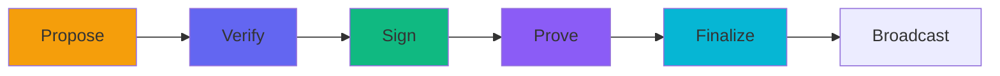
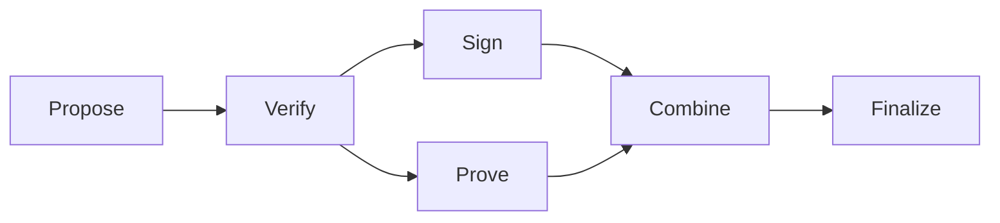

A t2z transaction goes through five distinct phases. Each phase can be performed by different parties or systems, enabling flexible transaction construction workflows.



## The Five Phases

<Steps>
  <Step title="Propose" icon="file-circle-plus">
    **Create the PCZT**
    
    Combine transparent inputs and payment outputs into a Partially Constructed Zcash Transaction.
    
    - Define which UTXOs to spend
    - Specify recipient addresses and amounts
    - Set change address and expiry height
    - ZIP 317 fee is calculated automatically
    
    [Learn more →](/flow/propose)
  </Step>
  
  <Step title="Verify" icon="shield-check">
    **Validate before signing** *(optional)*
    
    Ensure the PCZT matches your original request — important if the PCZT was handled by a third party.
    
    - Confirm all payments are present
    - Verify amounts match
    - Check for unexpected outputs (malleation)
    
    [Learn more →](/flow/verify)
  </Step>
  
  <Step title="Sign" icon="signature">
    **Add signatures**
    
    Sign each transparent input with the corresponding private key.
    
    - Get sighash for each input
    - Sign externally (hardware wallet, HSM) or internally
    - Append signatures to the PCZT
    
    [Learn more →](/flow/sign)
  </Step>
  
  <Step title="Prove" icon="wand-magic-sparkles">
    **Generate ZK proofs**
    
    Create Orchard zero-knowledge proofs for any shielded outputs.
    
    - First call builds proving key (~10 seconds)
    - Subsequent calls are fast (cached)
    - No trusted setup required (Halo 2)
    
    [Learn more →](/flow/prove)
  </Step>
  
  <Step title="Finalize" icon="flag-checkered">
    **Extract transaction**
    
    Perform final validation and extract the raw transaction bytes.
    
    - Verify all signatures present
    - Verify all proofs generated
    - Produce transaction ready for broadcast
    
    [Learn more →](/flow/finalize)
  </Step>
</Steps>

## Parallel Operations

Signing and proving can be done **in parallel** since they don't depend on each other:



If signing and proving are done by the same party sequentially, the combine step can be skipped.

## Example: Complete Flow

<Tabs>
  <Tab title="TypeScript">
    ```typescript
    import * as t2z from '@d4mr/t2z-wasm';

    // 1. PROPOSE
    let pczt = t2z.propose_transaction(inputs, payments, changeAddr, network, expiry);

    // 2. VERIFY (optional but recommended)
    t2z.verify_before_signing(pczt, payments, expectedChange);

    // 3. SIGN each input
    for (let i = 0; i < inputs.length; i++) {
      const sighash = t2z.get_sighash(pczt, i);
      const signature = await externalSign(sighash, keys[i]);
      pczt = t2z.append_signature(pczt, i, pubkeys[i], signature);
    }

    // 4. PROVE
    pczt = t2z.prove_transaction(pczt);

    // 5. FINALIZE
    const txHex = t2z.finalize_and_extract_hex(pczt);
    ```
  </Tab>
  <Tab title="Go">
    ```go
    // 1. PROPOSE
    pczt, _ := t2z.ProposeTransaction(inputs, payments, changeAddr, network, expiry)

    // 2. VERIFY (optional but recommended)
    t2z.VerifyBeforeSigning(pczt, payments, expectedChange)

    // 3. SIGN each input
    for i := range inputs {
        sighash, _ := t2z.GetSighash(pczt, i)
        signature := externalSign(sighash, keys[i])
        pczt, _ = t2z.AppendSignature(pczt, i, pubkeys[i], signature)
    }

    // 4. PROVE
    pczt, _ = t2z.ProveTransaction(pczt)

    // 5. FINALIZE
    txBytes, _ := t2z.FinalizeAndExtract(pczt)
    ```
  </Tab>
  <Tab title="Kotlin">
    ```kotlin
    // 1. PROPOSE
    var pczt = proposeTransaction(inputs, payments, changeAddr, network, expiry)

    // 2. VERIFY (optional but recommended)
    verifyBeforeSigning(pczt, payments, expectedChange)

    // 3. SIGN each input
    for (i in inputs.indices) {
        val sighash = getSighash(pczt, i.toUInt())
        val signature = externalSign(sighash, keys[i])
        pczt = appendSignature(pczt, i.toUInt(), pubkeys[i], signature)
    }

    // 4. PROVE
    pczt = proveTransaction(pczt)

    // 5. FINALIZE
    val txHex = finalizeAndExtractHex(pczt)
    ```
  </Tab>
</Tabs>

## Inspecting the PCZT

At any point, you can inspect the PCZT to see its current state:

```typescript
const info = t2z.inspect_pczt(pczt.to_hex());

console.log({
  totalInput: info.total_input,
  totalOutput: info.total_orchard_output + info.total_transparent_output,
  fee: info.implied_fee,
  signed: info.all_inputs_signed,
  proved: info.has_orchard_proofs,
});
```

[Learn more about inspect_pczt →](/api-reference/inspect-pczt)

