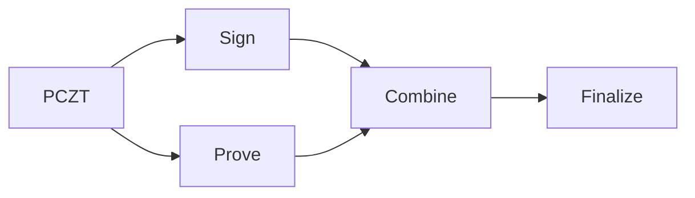

The `prove_transaction` function generates Halo 2 zero-knowledge proofs for all Orchard actions in the transaction.

## About Orchard Proofs

Orchard uses the **Halo 2** proving system which:
- Requires **no trusted setup** (unlike Groth16 used by Sapling)
- Builds the proving key **programmatically** (no downloads)
- Provides **recursive proof composition**

<Note>
  The first proof generation takes ~10 seconds to build the proving key. Subsequent proofs are fast because the key is cached.
</Note>

## Function Signature

<Tabs>
  <Tab title="TypeScript">
    ```typescript
    function prove_transaction(pczt: WasmPczt): WasmPczt
    ```
  </Tab>
  <Tab title="Go">
    ```go
    func ProveTransaction(pczt *Pczt) (*Pczt, error)
    ```
  </Tab>
  <Tab title="Kotlin">
    ```kotlin
    fun proveTransaction(pczt: Pczt): Pczt
    ```
  </Tab>
</Tabs>

## Basic Usage

<Tabs>
  <Tab title="TypeScript">
    ```typescript
    // Generate proofs (includes building proving key if not cached)
    const provedPczt = t2z.prove_transaction(pczt);
    
    // Verify proofs were added
    const info = t2z.inspect_pczt(provedPczt.to_hex());
    console.log('Has proofs:', info.has_orchard_proofs);
    ```
  </Tab>
  <Tab title="Go">
    ```go
    provedPczt, err := t2z.ProveTransaction(pczt)
    if err != nil {
        log.Fatal(err)
    }
    ```
  </Tab>
  <Tab title="Kotlin">
    ```kotlin
    val provedPczt = proveTransaction(pczt)
    ```
  </Tab>
</Tabs>

## Pre-building the Proving Key

To avoid the ~10 second delay during transaction construction, pre-build the proving key at app startup:

<Tabs>
  <Tab title="TypeScript">
    ```typescript
    // At app startup
    if (!t2z.is_proving_key_ready()) {
      console.log('Building Orchard proving key...');
      t2z.prebuild_proving_key();
      console.log('Proving key ready');
    }

    // Later, proving is fast
    const provedPczt = t2z.prove_transaction(pczt);
    ```
  </Tab>
  <Tab title="Go">
    ```go
    // At app startup
    if !t2z.IsProvingKeyReady() {
        fmt.Println("Building Orchard proving key...")
        t2z.PrebuildProvingKey()
        fmt.Println("Proving key ready")
    }
    ```
  </Tab>
  <Tab title="Kotlin">
    ```kotlin
    // At app startup
    if (!isProvingKeyReady()) {
        println("Building Orchard proving key...")
        prebuildProvingKey()
        println("Proving key ready")
    }
    ```
  </Tab>
</Tabs>

### Utility Functions

| Function | Description |
|----------|-------------|
| `prebuild_proving_key()` | Build and cache the proving key |
| `is_proving_key_ready()` | Check if proving key is cached |

## Browser Considerations

In browser environments, proving can block the UI. Consider:

### 1. Show Loading State

```typescript
setLoading(true);
await new Promise(r => setTimeout(r, 50));  // Let UI update

const provedPczt = t2z.prove_transaction(pczt);

setLoading(false);
```

### 2. Use Web Workers

For a non-blocking experience, run proving in a Web Worker:

```typescript
// worker.ts
import * as t2z from '@d4mr/t2z-wasm';

self.onmessage = (e) => {
  const pcztHex = e.data;
  const pczt = t2z.WasmPczt.from_hex(pcztHex);
  const proved = t2z.prove_transaction(pczt);
  self.postMessage(proved.to_hex());
};
```

```typescript
// main.ts
const worker = new Worker('worker.ts');
worker.postMessage(pczt.to_hex());
worker.onmessage = (e) => {
  const provedPczt = t2z.WasmPczt.from_hex(e.data);
};
```

### 3. Pre-build at Startup

Build the proving key while the user is entering transaction details:

```typescript
// Start pre-building immediately
const keyPromise = new Promise(resolve => {
  if (!t2z.is_proving_key_ready()) {
    t2z.prebuild_proving_key();
  }
  resolve();
});

// When user submits, wait for key if needed
await keyPromise;
const provedPczt = t2z.prove_transaction(pczt);
```

## Parallel with Signing

Proving and signing are independent — they can run in parallel:



```typescript
// Run in parallel
const [signedPczt, provedPczt] = await Promise.all([
  signAllInputs(pczt),
  proveTransaction(pczt)
]);

// Combine results
const combined = t2z.combine([signedPczt, provedPczt]);
```

<Note>
  If you're the same party doing both signing and proving sequentially, the combine step isn't needed — just do them in sequence on the same PCZT.
</Note>

## Performance

| Operation | Time (first run) | Time (cached) |
|-----------|------------------|---------------|
| Build proving key | ~10 seconds | N/A |
| Generate proof | ~1-2 seconds | ~1-2 seconds |

Performance varies by:
- CPU speed
- Number of Orchard actions
- Browser vs native runtime

## Verifying Proofs Were Added

```typescript
const info = t2z.inspect_pczt(provedPczt.to_hex());

if (info.has_orchard_proofs) {
  console.log('✓ Orchard proofs generated');
  console.log(`  Actions: ${info.num_orchard_actions}`);
} else {
  console.log('○ No proofs yet');
}
```

## Common Errors

<AccordionGroup>
  <Accordion title="Proving error">
    The proving process failed. This is rare but can happen if:
    - The PCZT is malformed
    - Memory constraints in browser
    
    Try refreshing and rebuilding the PCZT.
  </Accordion>
</AccordionGroup>

## Next Step

After proofs are generated (and all inputs are signed), proceed to [finalization](/flow/finalize) to extract the raw transaction.

