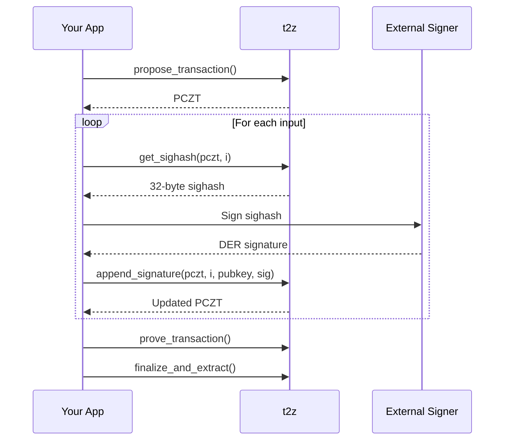

t2z's two-step signing process (`get_sighash` + `append_signature`) is designed for integration with external signers.

## Why External Signing?

- **Hardware wallets** — Ledger, Trezor, etc.
- **HSMs** — Hardware Security Modules for enterprise
- **Air-gapped systems** — Cold storage signing
- **Multi-signature** — Different parties contribute signatures

## The Flow



## Implementation

### 1. Get Sighash

```typescript
const sighashHex = t2z.get_sighash(pczt, inputIndex);
const sighashBytes = hexToBytes(sighashHex);
```

### 2. Sign Externally

The sighash is a standard 32-byte hash. Sign it with ECDSA secp256k1:

```typescript
// Generic external signing interface
const signature = await externalSigner.signEcdsa({
  message: sighashBytes,
  curve: 'secp256k1',
  // Hardware wallet specific options...
});
```

### 3. Format Signature

The signature must be DER-encoded with sighash type appended:

```typescript
// If signer returns DER
const sigWithType = new Uint8Array([...derSignature, 0x01]);

// If signer returns raw (r, s)
import { secp256k1 } from '@noble/curves/secp256k1';
const sig = new secp256k1.Signature(r, s);
const derSig = sig.toDERRawBytes();
const sigWithType = new Uint8Array([...derSig, 0x01]);
```

### 4. Append to PCZT

```typescript
pczt = t2z.append_signature(
  pczt,
  inputIndex,
  pubkeyHex,
  bytesToHex(sigWithType)
);
```

## Hardware Wallet Examples

### Ledger

```typescript
import TransportWebUSB from '@ledgerhq/hw-transport-webusb';
import Btc from '@ledgerhq/hw-app-btc';

const transport = await TransportWebUSB.create();
const btc = new Btc({ transport });

// Get sighash
const sighash = t2z.get_sighash(pczt, 0);

// Sign with Ledger
const result = await btc.signMessage(
  "44'/133'/0'/0/0",  // Zcash BIP44 path
  Buffer.from(sighash, 'hex').toString('hex')
);

// Append signature
pczt = t2z.append_signature(pczt, 0, pubkey, result.signature + '01');
```

### Trezor

```typescript
import TrezorConnect from '@trezor/connect';

const sighash = t2z.get_sighash(pczt, 0);

const result = await TrezorConnect.signMessage({
  path: "m/44'/133'/0'/0/0",
  message: sighash,
  hex: true,
});

pczt = t2z.append_signature(pczt, 0, pubkey, result.payload.signature + '01');
```

## Air-Gapped Signing

For maximum security, the PCZT can be transferred to an offline machine:

### Online Machine

```typescript
// Create PCZT
const pczt = t2z.propose_transaction(...);

// Export for offline signing
const pcztHex = pczt.to_hex();
// Transfer via QR code, USB drive, etc.
```

### Offline Machine

```typescript
// Import PCZT
const pczt = WasmPczt.from_hex(pcztHex);

// Sign all inputs
for (let i = 0; i < inputCount; i++) {
  const sighash = t2z.get_sighash(pczt, i);
  // Sign with cold storage key
  pczt = t2z.append_signature(pczt, i, pubkey, signature);
}

// Export signed PCZT
const signedHex = pczt.to_hex();
// Transfer back to online machine
```

### Online Machine (continued)

```typescript
// Import signed PCZT
const signedPczt = WasmPczt.from_hex(signedHex);

// Prove and finalize
const provedPczt = t2z.prove_transaction(signedPczt);
const txHex = t2z.finalize_and_extract_hex(provedPczt);

// Broadcast
await broadcast(txHex);
```

## Multi-Party Signing

Different parties can sign different inputs:

```typescript
// Party A signs input 0
const sighash0 = t2z.get_sighash(pczt, 0);
// Sign and append...
const pcztFromA = pczt.to_hex();

// Transfer to Party B...

// Party B signs input 1
const pczt = WasmPczt.from_hex(pcztFromA);
const sighash1 = t2z.get_sighash(pczt, 1);
// Sign and append...
```

## Security Considerations

<Warning>
  **Always verify before signing!** If the PCZT came from another party, call `verify_before_signing` to ensure it hasn't been modified.
</Warning>

```typescript
// Verify PCZT matches your intent
t2z.verify_before_signing(pczt, originalPayments, expectedChange);

// Only then sign
const sighash = t2z.get_sighash(pczt, 0);
```

